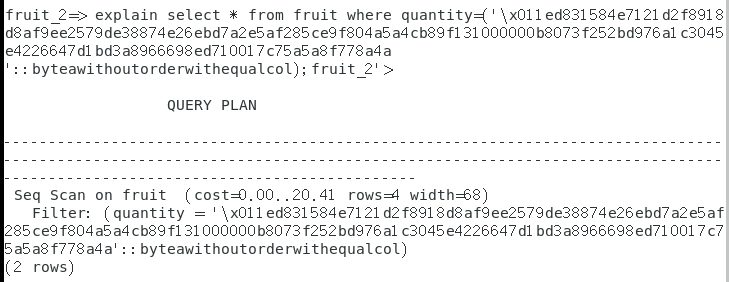
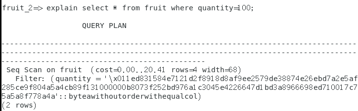

# 密态-执行计划

## 实验步骤

### 以明文态登录

1. 登录lily账号，进入明文模式

```sql
explain select * from fruit where fruit_name='Apple';
```

  结果如下：

```
                      QUERY PLAN                       
-------------------------------------------------------
 Seq Scan on fruit  (cost=0.00..20.41 rows=4 width=68)
   Filter: (fruit_name = 'Apple'::text)
(2 rows)
```

2. 但我一旦涉及到密文列，就会出问题不管以下哪种方式（已解决🤩🤩🤩）：
   - [x] 涉及加密列搜索密文
   - [x] 涉及加密列搜索明文

3. 首先是密文

```sql
explain select * from fruit where quantity=ed8315836d7013a091f7fab0539cf1e103ec021ac395ed0765e468672f7d4af3beba5e03100000046698ab1dced33bfa9688c044b34133f3645345077b64cb9eddf0fd7ae6fba28;
```

  报错如下：

```
NOTICE:  identifier "e468672f7d4af3beba5e03100000046698ab1dced33bfa9688c044b34133f3645345077b64cb9edd" will be truncated to "e468672f7d4af3beba5e03100000046698ab1dced33bfa9688c044b34133f36"
ERROR:  syntax error at or near "e468672f7d4af3beba5e03100000046698ab1dced33bfa9688c044b34133f3645345077b64cb9edd"
```

  意思就是被莫名其妙截断了

4. 解决密文列搜索——[函数和操作符 - 密态等值的函数 - 《华为 openGauss (GaussDB) v2.0 使用手册》 - 书栈网 · BookStack](https://www.bookstack.cn/read/opengauss-2.0-zh/a05112dd77e2c34d.md)

> byteawithoutorderwithequalcolin的实现会对cek进行查找，<u>并且判断是否为正常加密后的数据类型</u>。因此如果用户输入数据的格式不为加密后的数据格式，并且在本地不存在对应cek的情况下，会返回错误。

```sql
explain select * from fruit where quantity=('\x011ed831584e7121d2f8918d8af9ee2579de38874e26ebd7a2e5af285ce9f804a5a4cb89f131000000b8073f252bd976a1c3045e4226647d1bd3a8966698ed710017c75a5a8f778a4a
'::byteawithoutorderwithequalcol);
```

  结果如下：



😎😎密文终于可以操作了

5. 再试试明文

```sql
explain select * from fruit where quantity=100;
```

  报错如下（类型不对）：

```
ERROR:  operator does not exist: byteawithoutorderwithequalcol = integer
LINE 1: select * from fruit where quantity=100;
                                          ^
HINT:  No operator matches the given name and argument type(s). You might need to add explicit type casts.
```

### 以密文态登录

1. lily密态登录

```sql
gsql -p 5432 -d fruit_2  -U lily -r -C
```

2. 执行语句1——<u>为预估</u>

```sql
explain select * from fruit;
```

```
                       QUERY PLAN                        
---------------------------------------------------------
 Seq Scan on fruit  (cost=0.00..18.33 rows=833 width=68)
(1 row)
```

3. 执行语句2——会显示的更加详细，<u>为实际情况，非预估</u>

```sql
explain performance select * from fruit;
```

或

```sql
explain analyze select * from fruit;
```

```
                                              QUERY PLAN                       
                        
--------------------------------------------------------------------------------
------------------------
 Seq Scan on lily.fruit  (cost=0.00..18.33 rows=833 width=68) (actual time=0.216
..0.841 rows=8 loops=1)
   Output: fruit_id, fruit_name, quantity
   (Buffers: shared hit=1)
   (CPU: ex c/r=50681, ex row=8, ex cyc=405453, inc cyc=405453)
 Total runtime: 2.991 ms, Peak Memory :161 (KB)
(5 rows)
```

4. 执行语句3：

```sql
explain select * from fruit where quantity=100;
```



> 值得注意的是，即使我们select条件中是明文，最终呈现的是密文形式

5. 执行语句4：

```sql
explain performance select * from fruit where quantity=100;
```

报错：

```
fruit_2=> explain performance select * from fruit where quantity=100;
ERROR:  operator does not exist: byteawithoutorderwithequalcol = integer
LINE 1: explain performance select * from fruit where quantity=100;
                                                              ^
HINT:  No operator matches the given name and argument type(s). You might need to add explicit type casts.
```

  很奇怪，正常在密态下执行`select * from fruit where quantity=100;`是肯定没有问题的，但是在这个地方似乎出现了类型错误，查看官网，没有合适的类型转换（这本身就有bug，select这个单独执行明明可以）

## 结论

- 在明文下，如果需要密文等值查询需要进行类型转换，转换完成后（explain、explain performance都可以执行）
- 在密态下：
  - 如果使用explain就可以出结果，查询计划中的明文会被加密
  - 如果使用explain performance就会报错，个人认为是系统本身的缺陷问题（因为你本身按道理单独执行select不会有错的）

## 注意

### explain和explain analyze区别

当你执行`EXPLAIN SELECT * FROM fruit;`时，PostgreSQL返回该查询的基础执行计划，包括查询将如何被执行的信息（比如是否使用了顺序扫描或索引扫描），以及预估的成本和行数。但是，这个命令<u>不会提供</u>关于查询实际执行时间的信息，<u>只是基于统计信息的预估值</u>

`EXPLAIN ANALYZE`命令执行查询，并显示实际的执行时间和其他执行细节，包括每个步骤的实际行数和实际成本。这比仅使用`EXPLAIN`提供了更多关于查询性能的实际见解。使用`EXPLAIN ANALYZE`可以帮助你更准确地理解查询的性能，<u>因为它基于实际的查询执行情况而不是预估</u>。


