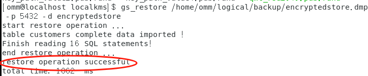

- [密态权限——备份恢复](#密态权限备份恢复)
  - [实验步骤](#实验步骤)
    - [备份](#备份)
      - [物理备份](#物理备份)
      - [逻辑备份](#逻辑备份)
    - [恢复](#恢复)
  - [结论](#结论)
  - [注意](#注意)
  - [References](#references)

# 密态权限——备份恢复

> 此功能需要确保在omm用户（DBA）下执行

## 实验步骤

### 备份

#### 物理备份

1. 以omm登录

```
su - omm 
```

  我的密码是：hrq021007

2. 创建存储备份文件夹，进行物理备份

```shell
mkdir -p /home/omm/physical/backup
```

```cmd
gs_basebackup -D /home/omm/physical/backup -p 5432
```


3. 切换到存储备份文件夹查看相关备份文件

```shell
cd /home/omm/physical/backup
```

```shell
ls
```


当数据库发生故障时需要从备份文件进行恢复。因为gs_basebackup是对数据库按<u>二进制进行备份</u>，因此恢复时可以直接拷贝替换原有的文件， 或者直接在备份的库上启动数据库。

#### 逻辑备份

  相当于是sql文件的形式

1. 切换到omm用户

```
su - omm              
```

2. 创建存储备份文件夹

```
mkdir -p /home/omm/logical/backup
```

3. 进行逻辑备份：

```
gs_dump -U omm  -f /home/omm/logical/backup/securedb.sql -p 5432 securedb -F p
```


4. 查看securedb.sql具体内容

```
cat securedb.sql
```


5. 但还是推荐备份成dmp格式的


### 恢复

1. 先登录到其它数据库，比如我登录到test，准备删除securedb（否则删不了）

```
gsql -p 5432 -d test -U omm -r -C
```

2. 删除securedb数据库，并重新进行创建

```
DROP DATABASE IF EXISTS securedb;
```

```
CREATE DATABASE securedb;
```

3. 退出数据库，并进行恢复

```sql
gs_restore /home/omm/logical/backup/securedb.dmp -p 5432 -d securedb
```


```
[omm@localhost backup]$ gs_restore /home/omm/logical/backup/securedb.dmp -p 5432 -d securedb
start restore operation ...
ERROR(CLIENT): cannot create file, the file '/opt/og/openGauss-server/dest/etc/localkms/key_path_value2.pub' already exists.
Error while PROCESSING TOC:
Error from TOC entry 4385; 0 0 GLOBALKEY GLOBALKEY 
could not execute query:     Command was: CREATE CLIENT MASTER KEY public.imgcmk2 WITH ( KEY_STORE = localkms , KEY_PATH = "key_path_value2", ALGORITHM = rsa_2048 );


Error from TOC entry 4386; 0 0 COLUMNKEY COLUMNKEY 
could not execute query: ERROR(CLIENT): no client master key found in local cache
    Command was: CREATE COLUMN ENCRYPTION KEY public.imgcek2 WITH VALUES (CLIENT_MASTER_KEY = public.imgcmk2, encrypted_value='`�t���Tq��t�!�...
Error from TOC entry 469; 1259 24694 TABLE encryptedcreditcards omm
could not execute query: ERROR:  object does not exist. column encryption key: imgcek2
    Command was: CREATE TABLE encryptedcreditcards (
    id integer NOT NULL,
    cardnumber character varying(50) encrypted with (column_enc...
could not execute query: ERROR:  relation "public.encryptedcreditcards" does not exist
    Command was: ALTER TABLE public.encryptedcreditcards OWNER TO omm;


Error from TOC entry 4377; 0 24694 TABLE DATA encryptedcreditcards omm
could not execute query: ERROR:  relation "encryptedcreditcards" does not exist
Command was: COPY encryptedcreditcards (id, cardnumber) FROM stdin;

Error from TOC entry 4023; 2606 24702 CONSTRAINT encryptedcreditcards_pkey omm
could not execute query: ERROR:  relation "encryptedcreditcards" does not exist
    Command was: ALTER TABLE encryptedcreditcards
    ADD CONSTRAINT encryptedcreditcards_pkey PRIMARY KEY (id);


Finish reading 11 SQL statements!
end restore operation ...
WARNING: errors ignored on restore: 6
restore operation successful
total time: 304  ms
```

> 1. **客户端主密钥（CMK）的创建问题**：
>    - 在尝试创建名为 `public.imgcmk2` 的客户端主密钥时，报错说文件 `/opt/og/openGauss-server/dest/etc/localkms/key_path_value2.pub` 已经存在。这意味着系统尝试创建一个新的密钥文件，但是由于同名文件已存在而失败。
>    - 接着，尝试创建列加密密钥（CEK）`public.imgcek2` 时，报错没有找到客户端主密钥。这可能是因为前一个步骤中密钥创建失败，导致系统找不到需要的 CMK。
> 2. **创建加密表和相关操作失败**：
>    - 由于 CMK 和 CEK 创建失败，接下来尝试创建和操作名为 `encryptedcreditcards` 的加密表时也失败了。错误信息提示对象不存在，这表明因为依赖的加密密钥未成功创建，导致加密表和相关操作（如设置表所有者、添加主键约束等）无法正常执行。


  并没有恢复成功
### 恢复实验补充

  删除掉`/opt/og/openGauss-server/dest/etc/localkms/`对应密钥的话，恢复就可以成功，与此同时我还发现之前比如omm授权给了用户A予以select的权利，在删除库以后重新备份之后，select仍然存在，并不会消失（也就是grant也被写入了恢复文件中）




## 结论

- 物理备份和逻辑备份并不会受阻
- 密态数据库似乎并不能直接进行恢复，但是删除密钥之后，可以进行恢复，但是需要注意如果采取随机化加密的形式，那么两次密态数据库的密文是不一样的

## 注意

目前我的密钥存储情况如下：

```
ls /opt/og/openGauss-server/dest/etc/localkms/
```


## References

- [openGauss数据库备份恢复指导手册_高斯多种备份-CSDN博客](https://blog.csdn.net/GaussDB/article/details/122920923)
