- [密态权限-补充](#密态权限-补充)
  - [授予update权限](#授予update权限)
    - [实验步骤](#实验步骤)
    - [结论](#结论)
  - [Insert监控（用户为私有用户，不授权）](#insert监控用户为私有用户不授权)
    - [实验准备](#实验准备)
      - [方案1：python脚本](#方案1python脚本)
      - [方案2：利用数据库存储过程](#方案2利用数据库存储过程)
    - [正式实验](#正式实验)
    - [结论](#结论-1)
  - [用户授权给DBA，DBA能否监控？（错误案例）](#用户授权给dbadba能否监控错误案例)
    - [准备工作](#准备工作)
    - [正式实验](#正式实验-1)
      - [授权select权限前](#授权select权限前)
        - [DBA监控普通用户](#dba监控普通用户)
        - [普通用户监控DBA](#普通用户监控dba)
      - [用户监控DBA](#用户监控dba)
      - [DBA监控用户](#dba监控用户)
        - [查询不涉及密文](#查询不涉及密文)
        - [查询涉及密文](#查询涉及密文)
    - [总结论](#总结论)
  - [用户授权给DBA，DBA能否监控？（私有用户，正确）](#用户授权给dbadba能否监控私有用户正确)
    - [预备工作](#预备工作)
    - [授权之前](#授权之前)
      - [DBA监控用户（查询涉及明文）](#dba监控用户查询涉及明文)
      - [DBA监控用户（查询涉及加密列）](#dba监控用户查询涉及加密列)
    - [授权之后](#授权之后)
      - [DBA对用户监控](#dba对用户监控)
      - [用户对DBA监控](#用户对dba监控)
        - [前置实验](#前置实验)
        - [监控](#监控)
    - [结论](#结论-2)
  - [References](#references)

# 密态权限-补充

## 授予update权限

### 实验步骤

1. 我们选取products数据库

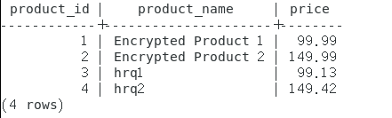

- 其第一列和第三列都是明文，第二列采取了加密

2. 我们登录密态omm授予lucy以update权限

3. lucy登录密态，执行select，<u>仍然是会报error，无法解密——说明update权限即使给了lucy，lucy没有获得相关密钥</u>

4. lucy登录密态，执行以下语句：

```sql
UPDATE products SET product_name = 'Updated Encrypted Product 2' WHERE product_id = 2;
```

  报错如下：

```
ERROR:  invalid input syntax for type byteawithoutorderwithequalcol
LINE 1: UPDATE products SET product_name = 'Updated Encrypted Produc...
                                           ^
CONTEXT:  referenced column: product_name

```

  依然不行，**我还尝试过在明文下只要对加密列进行操作**，依然不行

5. lucy执行一些和加密列无关的操作：

```sql
UPDATE products SET price = 109.99 WHERE product_id = 1;
```


  可以成功

### 结论

- 通过update尝试去进行恶意操作是不可行的

## Insert监控（用户为私有用户，不授权）

> 本实验主要研究DBA发起监控。首先明确，私有用户是只给DBA控制权，而无访问权，也就是用户连密文都不想让DBA看到

### 实验准备

  <u>select语句可以`pg_sleep(30)`，但是insert并不支持，故而我需要脚本持续捕捉当前查询，时间间隔阈值我设置的是`0.001s`</u>

#### 方案1：python脚本

  需要yum、python兼容，比较麻烦

```python
#!/usr/bin/env python
# -*- coding: utf-8 -*-

import psycopg2
from datetime import datetime

# 使用DBA账户信息直接连接数据库
con = psycopg2.connect(database='fruit_3', user='omm', host='127.0.0.1', port='5432')

def execute_query_and_log(query, log_file_path, repeats=100):
    """
    执行指定的SQL查询多次，并将结果记录到文本文件中。
    :param query: SQL查询字符串
    :param log_file_path: 日志文件的路径
    :param repeats: 查询重复执行的次数
    """
    with con:
        cur = con.cursor()
        with open(log_file_path, 'w') as log_file:
            for _ in range(repeats):
                # 获取当前时间戳
                timestamp = datetime.now().strftime('%Y-%m-%d %H:%M:%S')
                
                # 执行查询
                cur.execute(query)
                results = cur.fetchall()  # 获取所有返回的行
                
                # 将查询结果及时间戳写入日志文件
                log_file.write(f"Timestamp: {timestamp}\n")
                for result in results:
                    log_file.write(f"{result}\n")
                log_file.write("\n")  # 在每次查询结果之后添加一个新行以便区分
                
        print("查询完成并记录到文件。")

# 指定的SQL查询
query = """
SELECT pid, usename, query, state
FROM pg_stat_activity
WHERE state = 'active';
"""

# 执行函数
execute_query_and_log(query, 'db_activity_log.txt')

```

#### 方案2：利用数据库存储过程

```sql
DO $$
DECLARE
    rec record;
    i integer := 0;
BEGIN
    FOR i IN 1..100000 LOOP
        -- 执行指定的SELECT语句
        FOR rec IN SELECT pid, usename, query, state FROM pg_stat_activity WHERE state = 'active' LOOP
            -- 使用RAISE NOTICE来输出每行结果
            RAISE NOTICE 'PID: %, Username: %, Query: %, State: %', rec.pid, rec.usename, rec.query, rec.state;
        END LOOP;
        
        -- 每隔0.001s
        PERFORM pg_sleep(0.001);
    END LOOP;
END$$;
```

### 正式实验

> DBA此时的状态是无权select这个表，任何权利都没有，因为lily为私有用户

1. DBA执行方案2的存储过程语句
2. 与此同时，lily执行insert语句

```sql
INSERT INTO fruit(fruit_name, quantity) VALUES ('Apple5', 102);
```

  ps：建议先在终端2黏贴好Insert语句，然后再去复制存储过程，终端2先运行，终端1马上复制运行（不然就会导致终端内容太多，前面的内容会自动清除掉，而可能捕获的就在很前面），然后终端1马上中断（`ctrl+C`)。之后在终端1中用查找功能找Insert

3. 结果如下，我们捕获到了相关Insert语句

```
NOTICE:  PID: 139856577558272, Username: omm, Query: , State: active
NOTICE:  PID: 139856442750720, Username: omm, Query: WLM fetch collect info from data nodes, State: active
NOTICE:  PID: 139856657250048, Username: omm, Query: , State: active
NOTICE:  PID: 139856556058368, Username: omm, Query: , State: active
NOTICE:  PID: 139856217569024, Username: lily, Query: INSERT INTO fruit(fruit_name, quantity) VALUES ('Apple5', '\x011ed8315836d7013a091f7fab0539cf1e103ec021ac395ed0765e468672f7d4af3beba5e03100000046698ab1dced33bfa9688c044b34133f3645345077b64cb9eddf0fd7ae6fba28');, State: active
```

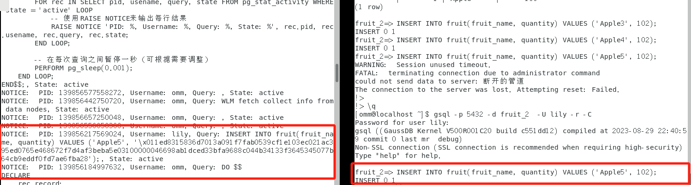

### 结论

- DBA即使没有被授权，也能监控到insert语句
- 即使用户为私有用户，不想让DBA知道任何数据库内容（包括密文），DBA还是可以从活跃表中看到
- 可能会引发差分攻击或者这个人最近加入了什么什么、最近购买了什么什么……

## 用户授权给DBA，DBA能否监控？（错误案例）

### 准备工作

1. DBA登录，创建新的数据库和角色

```sql
create user john with password "hrq021007!";
```

```sql
create database fruit_1 owner john;
```


2. john登录

```
 gsql -p 5432 -d fruit_1  -U john -r -C
```

  注意：还需要创建schema，不然会报public权限问题

```sql
CREATE SCHEMA john AUTHORIZATION john;
```

  创建密钥：

```sql
CREATE CLIENT MASTER KEY ImgCMK8 WITH (KEY_STORE = localkms, KEY_PATH = "key_path_value8", ALGORITHM = RSA_2048);
```

```sql
CREATE COLUMN ENCRYPTION KEY ImgCEK8 WITH VALUES (CLIENT_MASTER_KEY = ImgCMK8, ALGORITHM = AEAD_AES_256_CBC_HMAC_SHA256);
```

  创建fruit表

```sql
CREATE TABLE fruit(
    fruit_id SERIAL PRIMARY KEY,
    fruit_name TEXT,
    quantity INT ENCRYPTED WITH (column_encryption_key = ImgCEK8, encryption_type = DETERMINISTIC)
);
```

  插入语句：

```sql
INSERT INTO fruit(fruit_name, quantity) VALUES ('Apple', 100);
INSERT INTO fruit(fruit_name, quantity) VALUES ('Banana', 150);
INSERT INTO fruit(fruit_name, quantity) VALUES ('Cherry', 200);
```

4. <u>DBA检查能否看到，omm先进行连接，连接后查看数据库表，结果看不到任何表的存在</u>

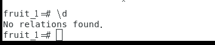

5. 我们查看数据库所有者，确实是john

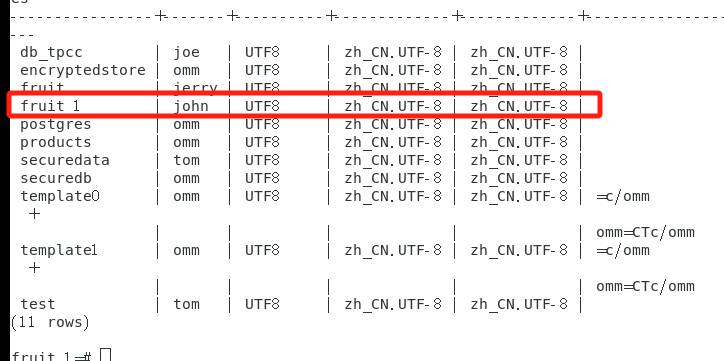

### 正式实验

#### 授权select权限前

##### DBA监控普通用户

1. DBA登录密态数据库明文模式

```
gsql -p 5432 -d  fruit_1 -r ;
```

2. john登录密态数据库

```
gsql -p 5432 -d  fruit_1 -U john -r -C ;
```

  执行延时查询操作：分为涉及明文的查询和涉及加密列的查询

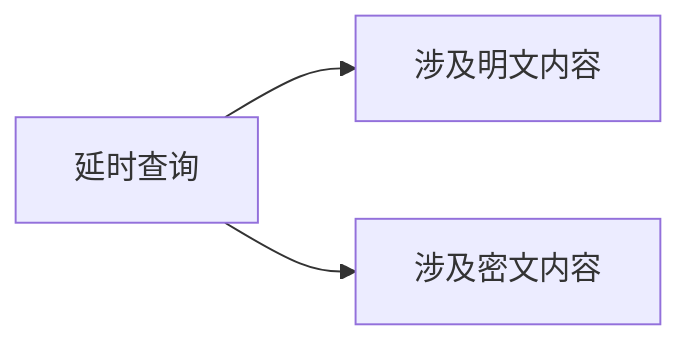

3. john进行涉及明文的查询，where的条件为不涉及加密的apple

```sql
SELECT  pg_sleep(30), *  FROM fruit where fruit_name='Apple';
```

4. DBA执行活跃查询

```sql
SELECT pid, usename, query, state
FROM pg_stat_activity
WHERE state = 'active';
```

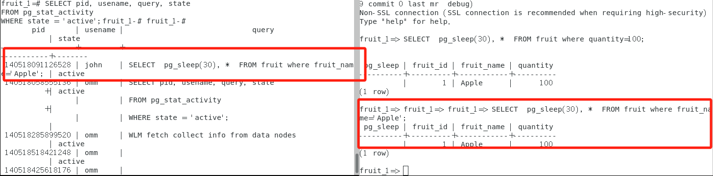

  DBA能看到john执行的语句，但是他得知了一些信息，<u>即表名、水果名、列的值（其实是泄露的，因为如果DBA连这个数据库，执行`\d`命令，他什么都看不到）</u>

5. john进行涉及加密列的查询，where的条件涉及加密列quantity

```sql
SELECT  pg_sleep(30), *  FROM fruit where quantity=100;
```

5. DBA执行活跃查询：

```
SELECT pid, usename, query, state
FROM pg_stat_activity
WHERE state = 'active';
```

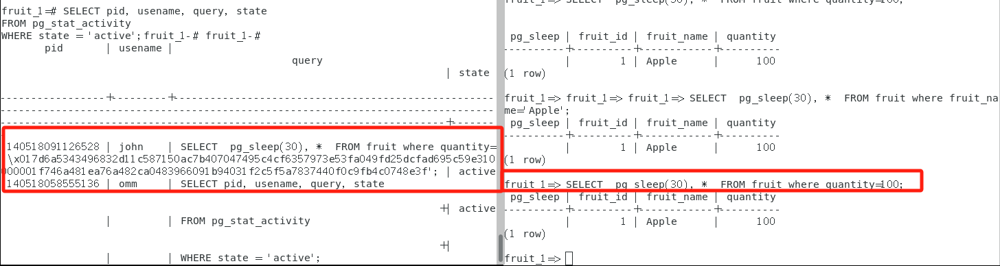

  DBA能够看到john在进行查询，但是john在密态下写的明文在DBA视角只能看到密文的形式

6. 结论：

| 情形                           | 结果                                                  |
| ------------------------------ | ----------------------------------------------------- |
| 普通用户进行明文查询（密态）   | DBA可以看到查询语句，泄露了表名、列名、以及相关列的值 |
| 普通用户进行加密列查询（密态） | DBA可以看到查询语句，但是DBA看到列的值是加密形式的    |


##### 普通用户监控DBA

  不存在此情形，因为此时DBA仅仅只有connect数据库的权限，甚至连里面的表是什么都不知道，因此DBA发起不了select

#### 用户监控DBA

1. jerry授权select权限给DBA用户

```sql
GRANT SELECT ON TABLE  fruit TO omm;
```

2. DBA登录明文态，准备进行延时查询

```sql
gsql -p 5432 -d  fruit  -r 
```

```sql
SELECT  pg_sleep(30), *  FROM fruit where fruit_name='Apple';
```

3. jerry立马进行活跃查询

```sql
SELECT pid, usename, query, state
FROM pg_stat_activity
WHERE state = 'active';
```

4. jerry端的显示结果如下：

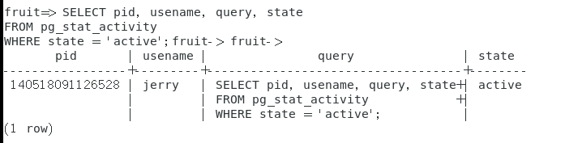

  看不到DBA的相关查询

#### DBA监控用户

##### 查询不涉及密文

1. jerry执行（密文下）

```sql
SELECT  pg_sleep(30), *  FROM fruit where fruit_name='Apple';
```

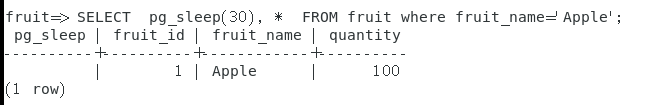

2. DBA执行活跃查询

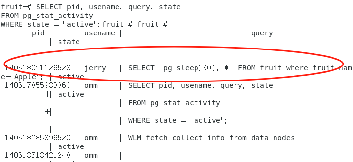

> 授权select关系为$jerry\rightarrow omm$，且fruit为omm所创建，DBA竟然能看到jerry对此的相关查询信息

##### 查询涉及密文

1. jerry执行（密文下）

```sql
SELECT  pg_sleep(30), *  FROM fruit where quantity=100;
```

2. DBA执行活跃查询

```sql
SELECT pid, usename, query, state
FROM pg_stat_activity
WHERE state = 'active';
```

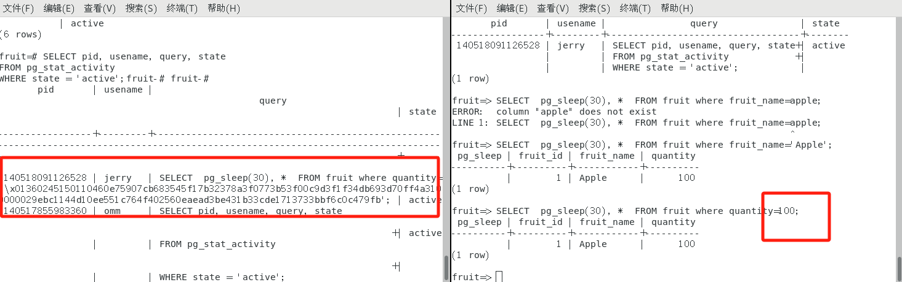

> <u>结果如上，对于DBA而言，看到的是密文形式的活跃查询</u>

### 总结论

> 这个方法不可行，DBA天然可以select、update，不需要授权，且天然具有密钥，因此我重新做过了实验

## 用户授权给DBA，DBA能否监控？（私有用户，正确）

### 预备工作

1. omm创建`私有用户`lily——三权分立，利用independent进行修饰

```sql
create user lily with independent identified by "hrq021007!";
```

  输出结果为：

```
WARNING:  Please carefully use independent user as it need more self-management.
HINT:  Self-management include logical backup, password manage and so on.
CREATE ROLE
```

2. 在omm下执行：

```sql
create database fruit_2 owner lily;
```

3. lily密态登录，创建schema，创建密钥，并用密钥创建加密数据库，对第三列进行加密

```sql
gsql -p 5432 -d fruit_2  -U lily -r -C
```

```sql
CREATE SCHEMA lily AUTHORIZATION lily;
```

```sql
CREATE CLIENT MASTER KEY ImgCMK9 WITH (KEY_STORE = localkms, KEY_PATH = "key_path_value9", ALGORITHM = RSA_2048);
```

```sql
CREATE COLUMN ENCRYPTION KEY ImgCEK9 WITH VALUES (CLIENT_MASTER_KEY = ImgCMK9, ALGORITHM = AEAD_AES_256_CBC_HMAC_SHA256);
```

```sql
CREATE TABLE fruit(
    fruit_id SERIAL PRIMARY KEY,
    fruit_name TEXT,
    quantity INT ENCRYPTED WITH (column_encryption_key = ImgCEK9, encryption_type = DETERMINISTIC)
);
```

```sql
INSERT INTO fruit(fruit_name, quantity) VALUES ('Apple', 100);
INSERT INTO fruit(fruit_name, quantity) VALUES ('Banana', 150);
INSERT INTO fruit(fruit_name, quantity) VALUES ('Cherry', 200);
```


4. 此时，omm想要查看内容，注意要加入lily修饰（在schema为lily的时候）

```sql
select * from lily.fruit;
```

  我尝试了在明文还是密文下，都是一个结果：

```
ERROR:  permission denied for relation fruit
```

### 授权之前

#### DBA监控用户（查询涉及明文）

开启两个终端，分别登录DBA和lily，lily进入密态，但是查询语句信息只有明文信息

lily执行：

```sql
SELECT  pg_sleep(30), *  FROM fruit where fruit_name='Apple';
```

omm执行：

```sql
SELECT pid, usename, query, state
FROM pg_stat_activity
WHERE state = 'active';
```

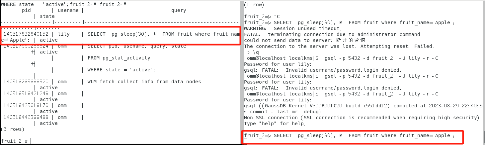

  **DBA即使没有对表的操作权限，但是他从监控中可以看到发起的SQL语句**

#### DBA监控用户（查询涉及加密列）

开启两个终端，分别登录DBA和lily，lily进入密态，此次查询语句涉及加密列

lily执行：

```sql
SELECT  pg_sleep(30), *  FROM fruit where quantity=100;
```

omm执行：

```sql
SELECT pid, usename, query, state
FROM pg_stat_activity
WHERE state = 'active';
```

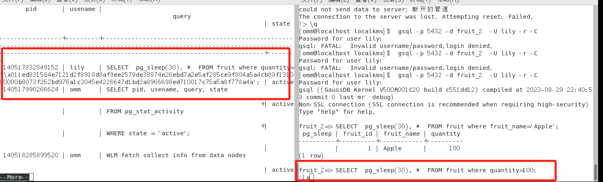

  **DBA可以看到用户发起的SQL语句，但是用户那边的100在DBA那端看到的加密形式**，且DBA在明文、密文下看到的结果是一样的

### 授权之后

#### DBA对用户监控

> 授权之前都能看到，毫无疑问，授权之后也是能看到的

#### 用户对DBA监控

##### 前置实验

  lily对DBA授权select权限

```sql
GRANT SELECT ON TABLE  fruit TO omm;
```

  DBA登录fruit_2数据库，以密态的形式，发动select语句

```sql
select * from lily.fruit;
```

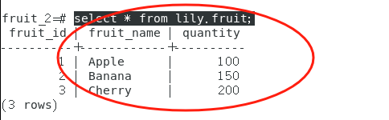

  **竟然能解密原始内容！！！**

  DBA查看当前客户端密钥，确实存在

```sql
SELECT * FROM gs_client_global_keys;
```

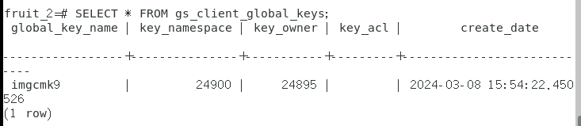

  lily现在revoke掉这个权限

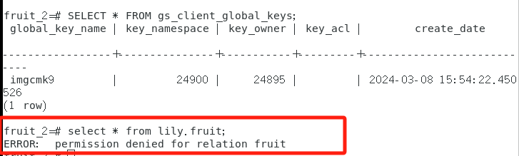

  **密钥还在，但是发起select会被权限禁止**

##### 监控

1. omm登录密态，执行：

```
SELECT  pg_sleep(30), *  FROM lily.fruit where fruit_name='Apple';
```

2. lily执行活跃查询

```sql
SELECT pid, usename, query, state
FROM pg_stat_activity
WHERE state = 'active';
```

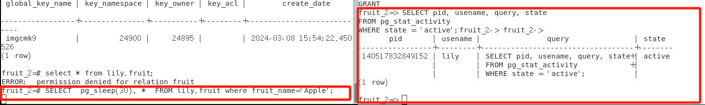

  结论：lily授权给了DBA，但是看不到DBA发起的SQL查询

### 结论

- [x] 即使在未授权之前，DBA就可以监控到普通用户的SQL语句，虽然permission denied
- [x] 普通用户授权给DBA之后，监控不到DBA发起的SQL查询
- [x] 普通用户授权给DBA以select权限之后，DBA可以看到明文形式（可以解密），即使revoke权限，密钥还在，只不过被permission denied
- [x] 我又试了另一个用户linda，在未授权之前，其实DBA那边已经有对应的cmk了。也就是并不是因为grant，而将cmk传过去，cmk天然就会到DBA那边
- [x] 综上，DBA应该还是初始就具有密钥，只是permission denied优先级更高，所以被挡住了

## References

- [什么，你了解吗？？新用户权限和permission denied for schema public - 知乎 (zhihu.com)](https://zhuanlan.zhihu.com/p/365139070)——新用户如何创建表

```sql
GRANT ALL PRIVILEGES TO jerry;
```

- 实际解决——[SQL Postgres 15. public模式权限被拒绝|极客笔记 (deepinout.com)](https://deepinout.com/sql/sql-questions/647_sql_postgres_15_permission_denied_for_schema_public.html)

当出现”permission denied for schema public”错误时，意味着当前用户对public模式的访问权限被拒绝。这可能由以下几个原因导致：

1. 用户权限不足：当前用户可能没有足够的权限来访问public模式中的对象。通常，只有特定的角色或超级用户才具有对public模式的完全访问权限。
2. 用户没有使用正确的登录方法：Postgres数据库有不同的身份验证方法，例如密码、证书、LDAP等。如果用户使用了不正确的登录方法，可能会导致权限被拒绝。
3. public模式被锁定：在某些情况下，系统管理员可能会选择锁定public模式，以防止用户对其进行更改或删除。这可能导致普通用户对public模式的访问权限被拒绝。

```sql
GRANT ALL PRIVILEGES ON SCHEMA public TO username;
```

- 查看在当前表的权限

```sql
SELECT table_schema, table_name, privilege_type
FROM information_schema.table_privileges
WHERE grantee = current_user AND table_name = 'fruit';
```

- [PostgreSQL模式（schema）介绍 - nealson - 博客园 (cnblogs.com)](https://www.cnblogs.com/eason23/p/10338550.html)
- [【PostgreSQL】PostgreSQL中public schema的权限和安全 - abce - 博客园 (cnblogs.com)](https://www.cnblogs.com/abclife/p/16410435.html)

```sql
GRANT ALL PRIVILEGES ON SCHEMA public TO username;
```

- 查看角色详情：[【openGauss简单使用】---创建用户和授权、创建数据库、创建SCHEMA、创建表-CSDN博客](https://blog.csdn.net/qq_41840843/article/details/131276547)

```sql
\dg
```

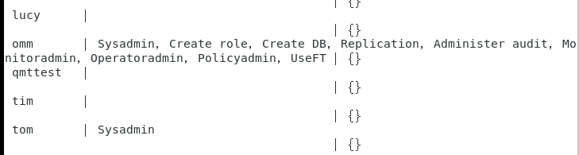

- 😎😎😎私有用户与三权分立（实际解决方案）：

  - https://www.bookstack.cn/read/openGauss-2.1-zh/Developerguide-%E7%94%A8%E6%88%B7.md
- [一文认识三权分立 - 墨天轮 (modb.pro)](https://www.modb.pro/db/1683067363556679680)

- 数据库日志保存在`/opt/ogdata/pg_log`下

