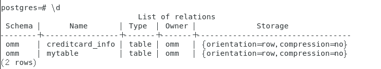

- [密态权限——授权](#密态权限授权)
  - [创建密态表](#创建密态表)
  - [密态下用户授权](#密态下用户授权)
    - [DBA-普通用户：实验步骤](#dba-普通用户实验步骤)
    - [普通用户-普通用户：实验步骤](#普通用户-普通用户实验步骤)
    - [实验结论](#实验结论)
  - [注意](#注意)
  - [References](#references)


# 密态权限——授权

## 创建密态表

1. 开启密态

```SQL
gsql -p 5432 -d test -U tom -r -C
```

2. 创建主密钥CMK，然后用它加密CEK，CEK是数据密钥，用于加密数据

   - 先创建CMK

   - ```sql
     CREATE CLIENT MASTER KEY ImgCMK WITH (KEY_STORE = localkms, KEY_PATH = "key_path_value", ALGORITHM = RSA_2048);
     ```

     创建成功会显示：CREATE CLIENT MASTER KEY

   - 再创建CEK

   - ```sql
     CREATE COLUMN ENCRYPTION KEY ImgCEK WITH VALUES (CLIENT_MASTER_KEY = ImgCMK, ALGORITHM = AEAD_AES_256_CBC_HMAC_SHA256);
     ```

     创建成功会显示：CREATE COLUMN ENCRYPTION KEY

3. 查看创建的密钥：

```sql
SELECT * FROM gs_client_global_keys;
```


4. 创建加密表，此时已经连了Postgres数据库，可以直接创，\d可以直接查看数据库内的表

```sql
 CREATE TABLE creditcard_info (id_number int, name text encrypted with (column_encryption_key = ImgCEK, encryption_type = DETERMINISTIC),credit_card  varchar(19) encrypted with (column_encryption_key = ImgCEK, encryption_type = DETERMINISTIC));
```



5. 插入数据即可，左为开启密态下，看到的是明文，退出密态模式查看，是密文形式


## 密态下用户授权

### DBA-普通用户：实验步骤

1. 登录securedb数据库

```
gsql -p 5432 -d securedb -r
```

2. 创建CMK、CEK

```sql
CREATE CLIENT MASTER KEY ImgCMK1 WITH (KEY_STORE = localkms, KEY_PATH = "key_path_value1", ALGORITHM = RSA_2048);
```

```sql
CREATE COLUMN ENCRYPTION KEY ImgCEK1 WITH VALUES (CLIENT_MASTER_KEY = ImgCMK1, ALGORITHM = AEAD_AES_256_CBC_HMAC_SHA256);
CREATE COLUMN ENCRYPTION KEY
```

3. 添加table、加入数据条目

```sql
 CREATE TABLE EncryptedCreditCards (
    ID INT PRIMARY KEY,
    CardNumber VARCHAR(50) ENCRYPTED WITH (COLUMN_ENCRYPTION_KEY = ImgCEK1, encryption_type = DETERMINISTIC)
);
```

```sql
INSERT INTO EncryptedCreditCards (ID, CardNumber) VALUES (1, '1234-5678-9012-3456');
INSERT INTO EncryptedCreditCards (ID, CardNumber) VALUES (2, '6543-2109-8765-4321');
```

4. 执行：

```sql
select * from encryptedcreditcards;
```


5. 开启另一个终端，登录lisa

- 密态下：

```sql
gsql -p 5432 -d securedb -U lisa -r -C
```


可以看到表名，但是权限禁止

- 明文下：

```sql
gsql -p 5432 -d securedb -U lisa -r 
```


可以看到表名，但是权限禁止

6. DBA授权给普通用户lisa，予以select的权限

```sql
GRANT SELECT ON encryptedcreditcards TO lisa;
```


显示成功授权

7. lisa连接数据库进行select查询

- 密文下：


可以看到，由于密态下需要看到明文，那么此时lisa不具备CMK（用户主密钥），因此无法解密给表加密（采取竖向加密的）CEK，故而显示ERROR

- 明文下：


  可以成功看到cardnumber的明文形式

### 普通用户-普通用户：实验步骤

1. 登录lisa，在密态下，<u>看得到有这个表，但是禁止select查询</u>

```
gsql -p 5432 -d test -U lisa -r -C
```


显示错误，权限禁止：

```
test=> select * from creditcard_info;
ERROR:  permission denied for relation creditcard_info
```

2. 启动密态，tom授权给lisa

```
GRANT SELECT ON creditcard_info TO lisa;
```


3. 授权完毕后，另开一个终端，启动密态，查看lisa，<u>并进行select语句调用</u>


显示新的错误，无法进行解密：

```
test=> select * from creditcard_info;
ERROR(CLIENT): failed to decrypt column encryption key
```

4. 启动明文，登录lisa，并进行select语句调用

```
gsql -p 5432 -d test -U lisa -r
```

```
select * from creditcard_info ;
```


### 实验结论

- grant在密态下是成立的
- 被grant的用户：
  - 开启密态是看不到的，因为开启密态是要看明文，他没有相关密钥解密不了，所以报错
  - 开启明文是不会报错的，可以看到数据库内容的密文形式
- 权限禁止的优先级高于解密不了CEK的优先级
- DBA-普通用户、普通用户-普通用户是一样的结论

## 注意

- 密钥存储在`/opt/og/openGauss-server/dest/etc/localkms/`下，四个为一组，可以删除


CREATE CLIENT MASTER KEY ImgCMK WITH (KEY_STORE = localkms, KEY_PATH = "key_path_value", ALGORITHM = RSA_2048);——所以这个key_path_value是名字？

> 是的，确实是，命名注意唯一性， ImgCMK、key_path_value都要重新命名过

## References

- [openGauss 5.0.0全密态数据库应用小试-CSDN博客](https://blog.csdn.net/GaussDB/article/details/136184131)
- [【好文推荐】openGauss 5.0.0 数据库安全——全密态探究_opengauss数据库等保安全设置-CSDN博客](https://blog.csdn.net/renxyz/article/details/133275201)
