- [密态权限-性能调优、监控](#密态权限-性能调优监控)
  - [准备工作](#准备工作)
  - [实验步骤](#实验步骤)
    - [监控](#监控)
      - [DBA监控普通用户查询](#dba监控普通用户查询)
      - [被授权普通用户监控DBA](#被授权普通用户监控dba)
      - [非授权用户监控他人](#非授权用户监控他人)
      - [授权用户监控授权用户](#授权用户监控授权用户)
      - [结论](#结论)
    - [性能调优](#性能调优)
      - [大致思路](#大致思路)
      - [系统瓶颈定位与调优](#系统瓶颈定位与调优)
      - [SQL调优](#sql调优)
        - [查看运行时间最长](#查看运行时间最长)
        - [分析作业是否阻塞](#分析作业是否阻塞)
      - [结论](#结论-1)
  - [注意](#注意)
  - [References](#references)

# 密态权限-性能调优、监控

## 准备工作

  可以通过查询 `pg_stat_activity` 系统视图来查看所有活跃的查询，包括哪个用户正在执行哪个查询：

```sql
SELECT pid, usename, query, state
FROM pg_stat_activity
WHERE state = 'active';
```

  但是只能捕捉实时查询，如果是历史查询，那么在存储上负担极大

  创建一个长时间运行的select查询，利用 `pg_sleep` 函数，使得查询故意延迟：

```sql
SELECT  pg_sleep(30), *  FROM products where price=99.99;
```

  创建2个用户tim、lucy

```sql
CREATE USER tim PASSWORD 'hrq021007!';
```

```sql
CREATE USER lucy PASSWORD 'hrq021007!';
```

  omm创建products、encrypteddb数据库，且用密态建表，之后赋予tim、lucy予以select权限，lucy是products，tim是encrypteddb

  开启两个终端，分别登录tim和lucy

```
gsql -p 5432 -d products -U lucy -r -C
```

```
gsql -p 5432 -d encrypteddb -U tim -r -C
```


## 实验步骤

### 监控

#### DBA监控普通用户查询

1. 登录omm的DBA账户

```
gsql -p 5432 -d products -r -C
```

2. 执行查询

```sql
select * from products;
```

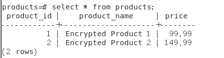

可以看到密文数据库开启后，看到的是明文

3. 开启另一个终端lucy（前提是omm授权了products的select权限给lucy），<u>此时开启明文状态</u>，你在密文状态下本身进行select操作就会报错（没有密钥进行解密）

```
gsql -p 5432 -d products -U lucy -r
```

4. lucy执行语句，<u>务必确保此时lucy在明文下执行</u>（否则会报错）

```sql
SELECT  pg_sleep(30), *  FROM products where price=99.99;
```

5. 此时切换回终端1，此时omm执行

```sql
SELECT pid, usename, query, state
FROM pg_stat_activity
WHERE state = 'active';
```

6. 可以得到以下结果：

- lucy端

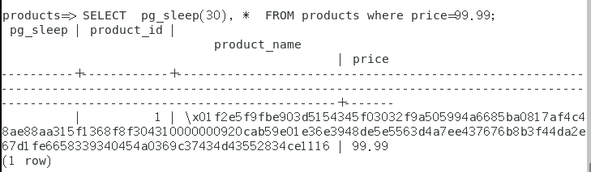

- omm端

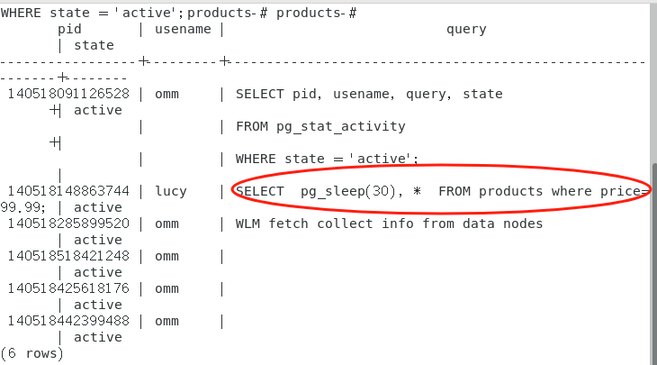


- 我们能看到lucy进行了具体的查询语句，且经过实验验证，无论omm开启密文还是明文模式，都能看到实时查询
- 但注意，这也仅限于实时查询

7. 过30s，在omm端执行

```sql
SELECT pid, usename, query, state
FROM pg_stat_activity
WHERE state = 'active';
```

  得到内容如下所示，已经看不到lucy的查询内容了

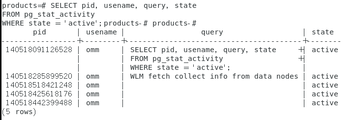

#### 被授权普通用户监控DBA

1. 开启两个终端，分别登录omm和lucy

```
gsql -p 5432 -d products -r -C
```

```
gsql -p 5432 -d products -U lucy -r 
```

2. omm执行延时查询

```sql
SELECT  pg_sleep(30), *  FROM products where price=99.99;
```

3. lucy立马查看活跃查询

```sql
SELECT pid, usename, query, state
FROM pg_stat_activity
WHERE state = 'active';
```

结果如下所示，我们知道授权关系为$omm\rightarrow lucy$，且仅授权了select的权利：

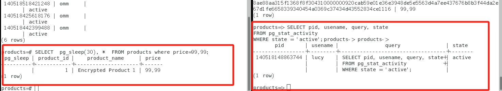

- 结论：lucy看不到omm进行的查询

#### 非授权用户监控他人

> 假设tim具有connect数据库的权限，除此之外其所有权限不具备

结论：tim<u>监控不到</u>实时查询

#### 授权用户监控授权用户

1. omm先需要授权select权限给tim

```sql
GRANT SELECT ON products TO tim;
```

2. lucy做延时查询

```sql
SELECT  pg_sleep(30), *  FROM products where price=99.99;
```

3. tim做活跃查询

```sql
SELECT pid, usename, query, state
FROM pg_stat_activity
WHERE state = 'active';
```

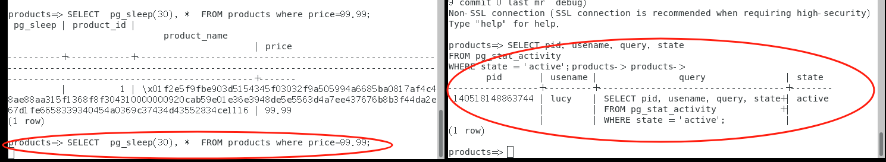

  结论：两个被授权的用户都互相看不到对方的查询

#### 结论

|         角色A         |          角色B          |       监控情况       |
| :-------------------: | :---------------------: | :------------------: |
|          DBA          |  仅grant了select的权限  | A可以看到B，B看不到A |
| 仅grant了select的权限 |  仅grant了select的权限  |    A、B互相看不到    |
| 仅grant了select的权限 | 只有connect数据库的权限 | B发起监控，B看不到A  |

- 一般也不会grant所有权限，因为数据库的最小权限原则（Principle of Least Privilege，POLP），这意味着用户、程序或系统进程只被授予它们完成任务所必需的最低权限，旨在减少安全风险和降低潜在的损害范围。

### 性能调优

#### 大致思路

  大致思路如下图所示：

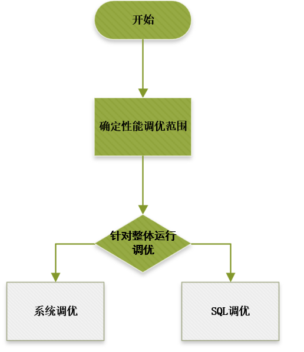

- 确定性能调优范围：获取CPU、内存、I/O和网络资源的使用情况，确认资源是否已经被充分利用，是否存在瓶颈
- 系统调优：顾名思义，侧重于整体系统层面，进行操作系统级以及数据库系统级的调优，<u>更充分地利用机器的CPU、内存、I/O和网络资</u>源，避免资源冲突，提升整个系统查询的<u>吞吐量</u>。
- SQL调优：审视业务所用SQL语句是否存在可优化空间
  - 通过ANALYZE语句生成表统计信息：ANALYZE语句可收集与数据库中表内容相关的统计信息，统计结果存储在系统表PG_STATISTIC中。执行计划生成器会使用这些统计数据，<u>以确定最有效的执行计划</u>。
  - 分析执行计划：EXPLAIN语句可显示SQL语句的执行计划，EXPLAIN PERFORMANCE语句可显示SQL语句中各算子的<u>执行时间</u>。
  - 查找问题根因并进行调优：通过分析执行计划，找到可能存在的原因，进行针对性的调优，<u>通常为调整数据库级SQL调优参数</u>。
  - 编写更优的SQL：介绍一些复杂查询中的中间临时数据缓存、结果集缓存、结果集合并等场景中的更优SQL语法。

#### 系统瓶颈定位与调优

  该部分与密态数据库验证任务的关系不大，甚至不需要登录到数据库，这边略微做下验证

  以其中一项——查看CPU的使用情况为例：

```
top -H
```

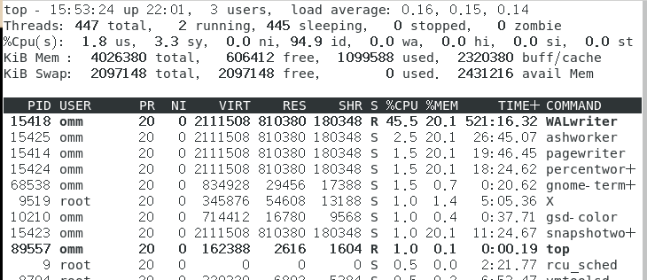

  找到CPU占用率最高的PID：15418

```
 top -H -p 15418
```

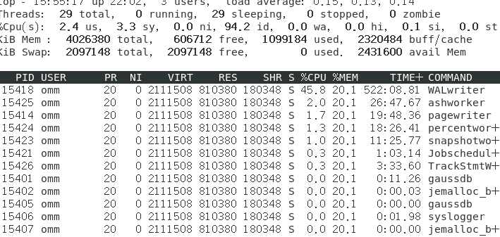

  还可以查看堆栈，进一步分析参数，这里不详细展开

#### SQL调优

##### 查看运行时间最长

  omm登录密态，lucy登录明文（因为lucy要发起查询，它必须在明文下发起），需要开启两个终端

```
gsql -p 5432 -d products -r -C
```

```
gsql -p 5432 -d products -U lucy -r
```

  lucy先执行一个延时查询：

```sql
SELECT  pg_sleep(30), *  FROM products where price=99.99;
```

  omm再执行运行时间最长的查询：

```sql
SELECT current_timestamp - query_start AS runtime, datname, usename, query FROM pg_stat_activity where state != 'idle' ORDER BY 1 desc;
```

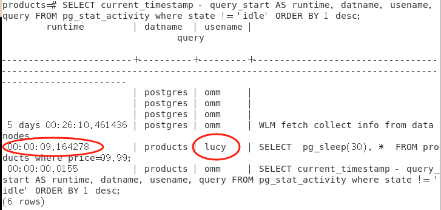

  查询后会按执行时间从长到短顺序返回查询语句列表，第一条结果就是当前系统中执行时间最长的查询语句。<u>返回结果中包含了系统调用的SQL语句和用户执行SQL语句</u>，请根据实际找到用户执行时间长的语句。

  对阈值也可以进行调整，更有针对地进行检索。对于排第一的用户SQL查询语句，可以重点考虑对之进行优化。

##### 分析作业是否阻塞

  数据库系统运行时，在某些业务场景下查询语句会被阻塞，导致语句运行时间过长，可以强制结束有问题的会话。

- 查看阻塞的查询语句及阻塞查询的表、模式信息，<u>该查询返回线程ID、用户信息、查询状态，以及导致阻塞的表、模式信息</u>（如果阻塞太久，**可以后期将之kill掉**）：

```sql
SELECT w.query as waiting_query,
w.pid as w_pid,
w.usename as w_user,
l.query as locking_query,
l.pid as l_pid,
l.usename as l_user,
t.schemaname || '.' || t.relname as tablename
from pg_stat_activity w join pg_locks l1 on w.pid = l1.pid
and not l1.granted join pg_locks l2 on l1.relation = l2.relation
and l2.granted join pg_stat_activity l on l2.pid = l.pid join pg_stat_user_tables t on l1.relation = t.relid
where w.waiting;
```

  提取相应的线程ID，将之kill掉：

```sql
SELECT PG_TERMINATE_BACKEND(139834762094352);
```

- 当然也可以看active的信息：

```sql
SELECT w.query AS active_query,
       w.pid AS active_pid,
       w.usename AS active_user,
       t.schemaname || '.' || t.relname AS tablename
FROM pg_stat_activity w
JOIN pg_locks l ON w.pid = l.pid
JOIN pg_stat_user_tables t ON l.relation = t.relid
WHERE w.state = 'active';
```

  lucy做延迟查询，omm提取active的线程信息（<u>omm处于密态</u>），结果如下所示，可以看到相应的线程ID

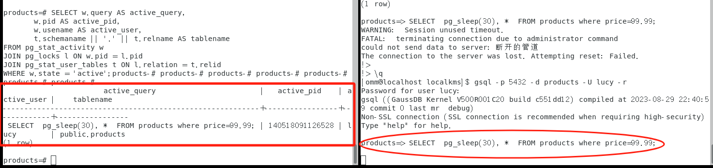

#### 结论

- 在密态数据库下，DBA能够去查询最耗性能的SQL语句
- 在密态数据库下，DBA能去查看相应的阻塞语句，并通过选取pid对之进行kill
- 对于耗时严重的用户发起的SQL语句，DBA可以进一步查看，对之进行优化

## 注意

1. 查看当前用户权限

```sql
SELECT grantee, table_schema, table_name, privilege_type
FROM information_schema.role_table_grants
WHERE grantee = CURRENT_USER;
```

可以查看当前登陆该数据库的人的权限

2. 在用户创建数据库之前，<u>omm记得赋予其权限</u>

```sql
ALTER USER lisa CREATEDB;
```

3. 需要注意一个问题，在进行最长时间查询的时候，active代表仍然在跑的没有阻塞的，所以那种单纯的select，你去看最长查询时间是搜不到的（因为我们发起的语句是查看仍然active的），<u>active和idle(空闲，表示此连接处于空闲，等待用户输入命令)是不同概念</u>，注意区分。

## References

- [openGauss数据库性能调优概述及实例分析_openguss性能-CSDN博客](https://blog.csdn.net/GaussDB/article/details/124602951)
