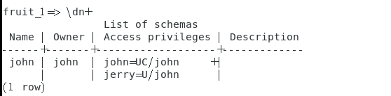
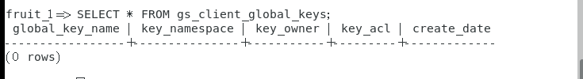
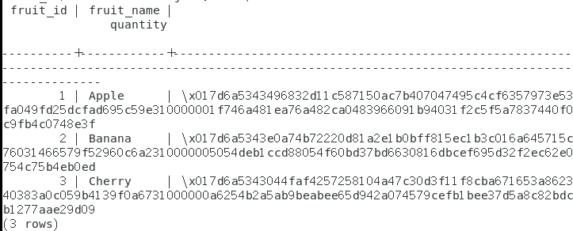

# 密态权限-revoke

## 实验步骤

### 普通用户-普通用户

> 我们选择两个普通用户john、jerry，john是自己创建了database、schema

1. john需要先授权schema，再授权表的权限，如果直接授权表，jerry还是被拒绝。（<u>但是如果是DBA，就不需要授权schema，直接授权表的权限即可</u>）

```sql
GRANT USAGE ON SCHEMA john TO jerry;
```

```sql
grant select on john.fruit to jerry;
```

2. 此时查看schema权限

```sql
\dn+
```



3. jerry登录，然后查询当前的权限

```sql
SELECT table_schema, table_name, privilege_type
FROM information_schema.table_privileges
WHERE grantee = current_user AND table_name = 'fruit';
```

  结果如下：

```
table_schema | table_name | privilege_type 
--------------+------------+----------------
 john         | fruit      | SELECT
(1 row
```

4. jerry查看密钥，并不具备CMK

```sql
SELECT * FROM gs_client_global_keys;
```



5. jerry进行查询

```sql
select * from john.fruit;
```



6. 此时，john revoke掉select的权限

```sql
revoke select on john.fruit from jerry;
```

7. jerry再去进行查询

```sql
select * from john.fruit;
```

```
ERROR:  permission denied for relation fruit
```

  会直接被权限禁止

### DBA-普通用户

- DBA天然具有对普通用户表的访问权、控制权，并不需要任何授权。在普通用户创建密钥的时候，其会天然到DBA那边，DBA可以select出自己具备的密钥。
- 当你去查询DBA在这个表上的权限的时候，并不会显示具有任何权限，但是DBA天然就是可以进行操作
- 普通用户即使revoke，DBA还是能看到

### DBA-私有用户

- 权限禁止的优先级高于其他，私有用户其实一开始所有的密钥也会到DBA那边，但是权限禁止的优先级最高，所以进行不了任何操作（<u>已经验证</u>）

- 私有用户需要授权DBA访问表的权利（不需要授予访问schema的权利），此时DBA可以访问
- revoke之后，DBA无法对私有用户表进行访问

## 结论

|  角色A   |  角色B   |                      结论                      |
| :------: | :------: | :--------------------------------------------: |
|   DBA    | 普通用户 |          天然可操作，revoke后依旧有效          |
|   DBA    | 私有用户 | 存在访问隔离，授权后可访问，revoke后不可以访问 |
| 普通用户 | 普通用户 | 授权schema、select后可访问，revoke后不可以访问 |

## 注意

- 当仅仅只授权schema访问权的时候，能得知表名。

```sql
SELECT table_name
FROM information_schema.tables
WHERE table_schema = 'john';
```

