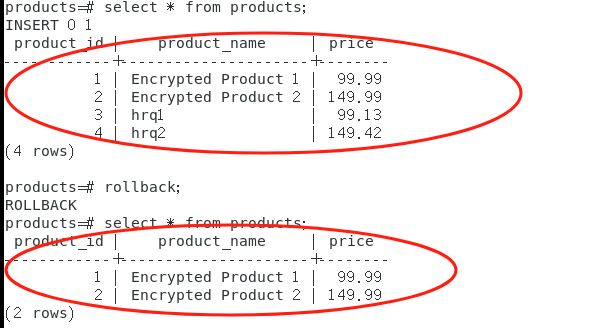

- [密态权限-事务与并发控制](#密态权限-事务与并发控制)
  - [实验步骤](#实验步骤)
    - [事务管理](#事务管理)
      - [Rollback回滚验证](#rollback回滚验证)
      - [Commit提交验证](#commit提交验证)
      - [结论](#结论)
    - [并发控制](#并发控制)
  - [References](#references)

# 密态权限-事务与并发控制

## 实验步骤

### 事务管理

#### Rollback回滚验证

1. 连接数据库，开启密态开关

```
gsql -p 5432 -d products -r -C
```

2. 启动事务

```sql
START TRANSACTION;
```

3. 插入数据

```sql
INSERT INTO products (product_id, product_name, price) VALUES (3, 'hrq1', 99.13);
INSERT INTO products (product_id, product_name, price) VALUES (4, 'hrq2', 149.42);
```

4. 查询

```sql
select * from products;
```


5. 回滚事务

```sql
rollback;
```

6. 再次查询：我们发现表又回到了原始的状态




#### Commit提交验证

1. 启动事务

```sql
START TRANSACTION;
```

2. 插入数据

```sql
INSERT INTO products (product_id, product_name, price) VALUES (3, 'hrq1', 99.13);
INSERT INTO products (product_id, product_name, price) VALUES (4, 'hrq2', 149.42);
```

3. 提交事务

```sql
COMMIT TRANSACTION;
```

4. 查询

```sql
select * from products;
```


  可以看到添加的条目成功进入数据库中

#### 结论

- 事务提交、回滚等在密态数据库下依然成立

### 并发控制

1. 开启两个终端，分别是omm的密态，lucy的明文态

```
gsql -p 5432 -d products -r -C
```

```
gsql -p 5432 -d products -U lucy -r
```

2. 终端1：开启事务1

```sql
begin;
```

3. 终端1：加共享锁

```sql
lock table products in share mode;
```


4. 终端1：查询

```sql
select * from products where product_id=1;
```

5. 终端2：开启事务2

```sql
begin;
```

6. 终端2：加共享锁

```sql
lock table products in share mode;
```

  

  有锁，加锁失败

7. 终端1：commit

```sql
commit;
```

8. 终端2：尝试再次加锁

```sql
lock table products in share mode;
```

  允许加

9. 终端2：commit

```sql
commit
```

## References

- [【数据库原理实验(openGauss)】事务与并发控制-CSDN博客](https://blog.csdn.net/BlacKingZ/article/details/117913077)

- https://blog.csdn.net/weixin_43871785/article/details/133231284
